# 4. Шаги выполнения процесса преобразования РВ в КА

## Исходный обобщенный граф переходов

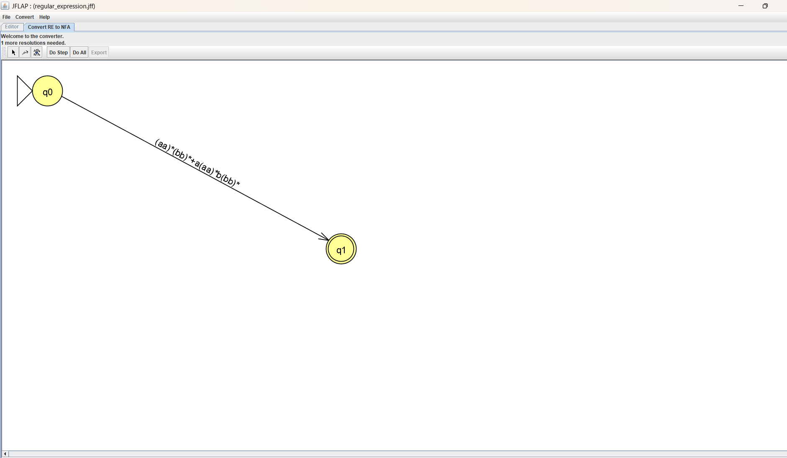

## 1-й этап преобразования

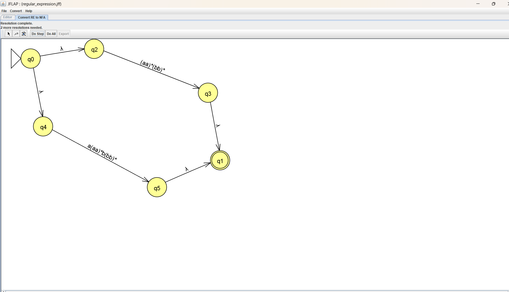

## 2-й этап преобразования

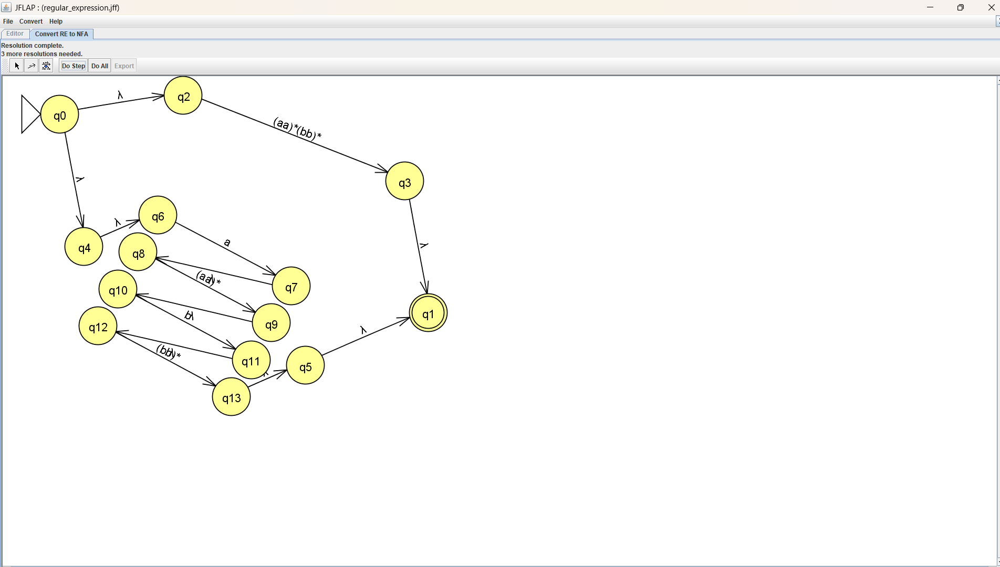

## 3-й этап преобразования

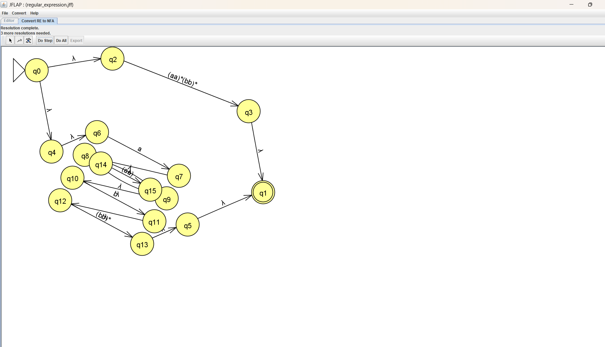

## 4-й этап преобразования

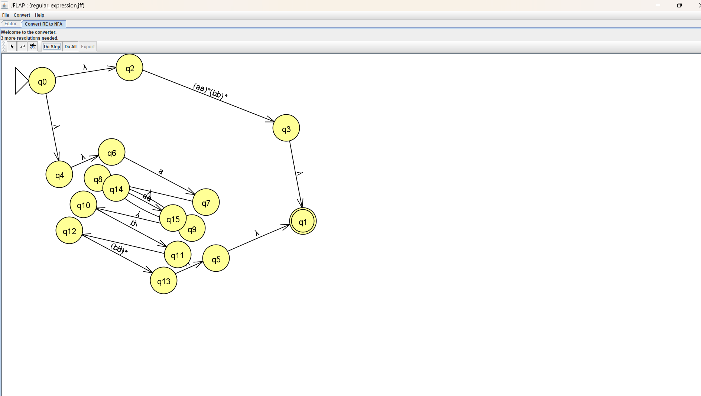

## 5-й этап преобразования

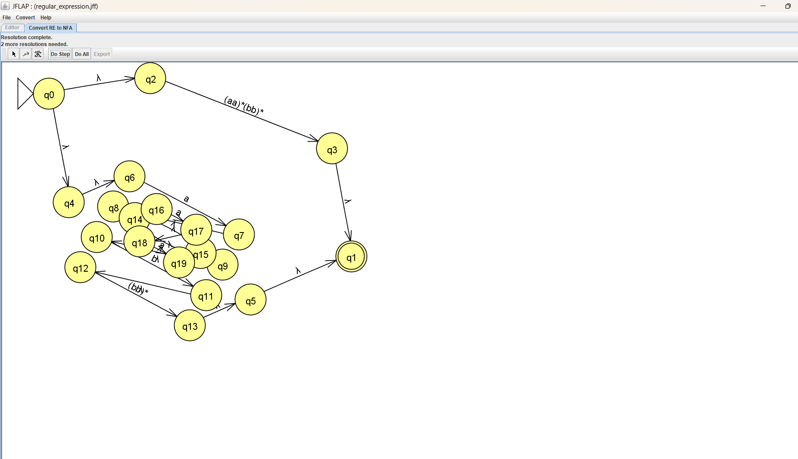

## 6-й этап преобразования

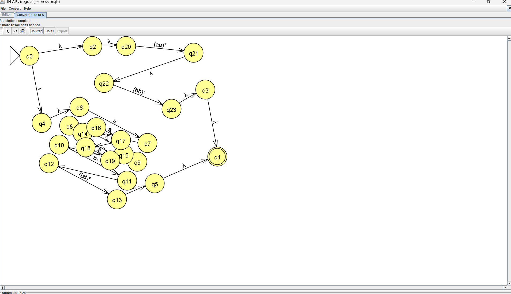

## 7-й этап преобразования

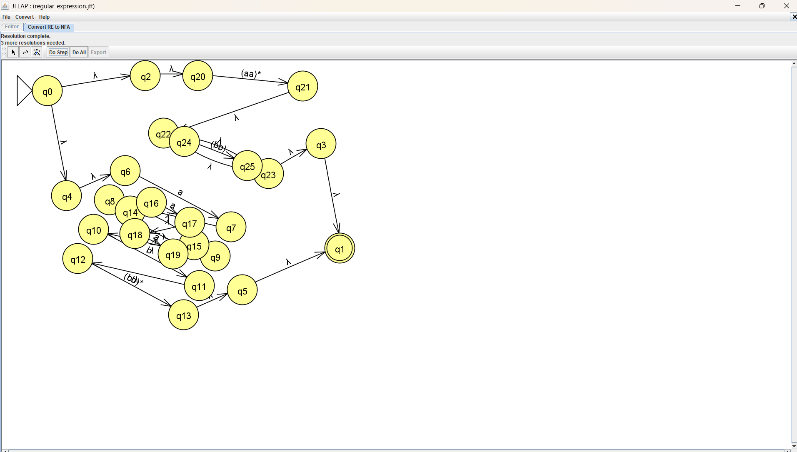

## 8-й этап преобразования

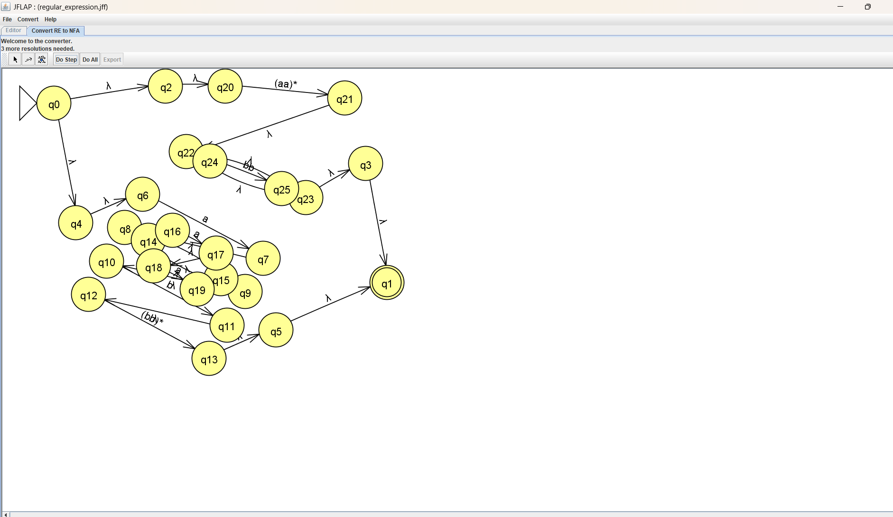

## 9-й этап преобразования

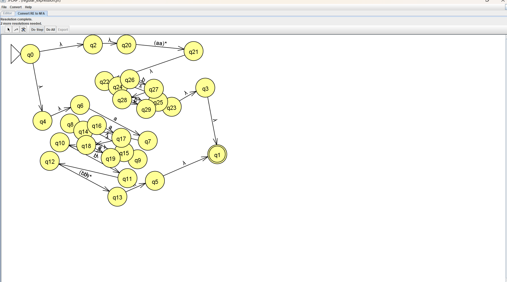

## 10-й этап преобразования

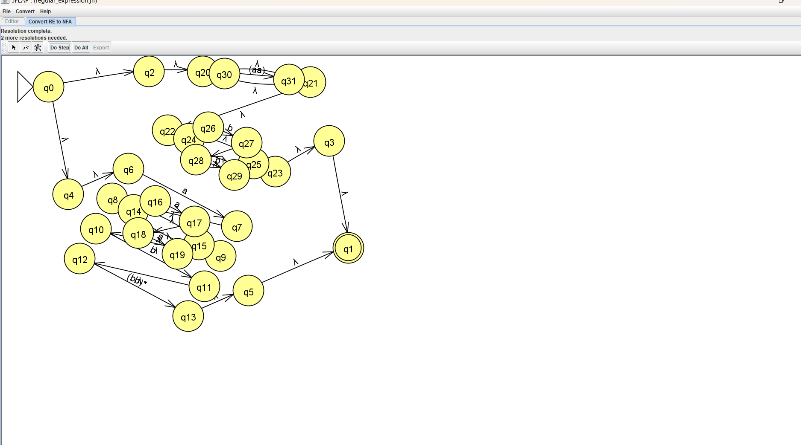

## 11-й этап преобразования

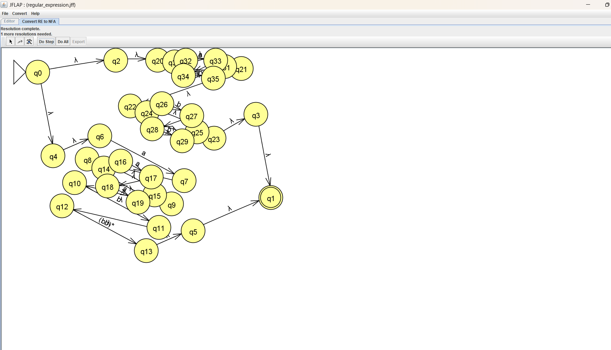

## 12-й этап преобразования

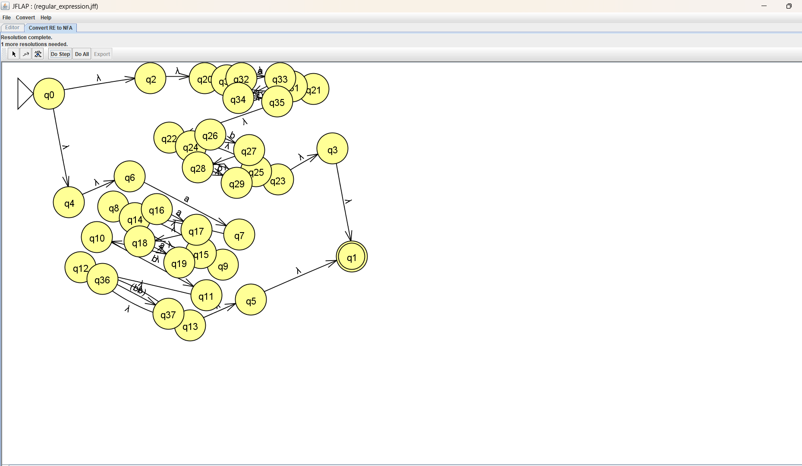

## 13-й этап преобразования

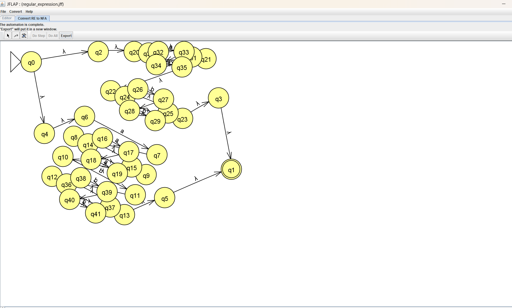

## Проверка полученного автомата

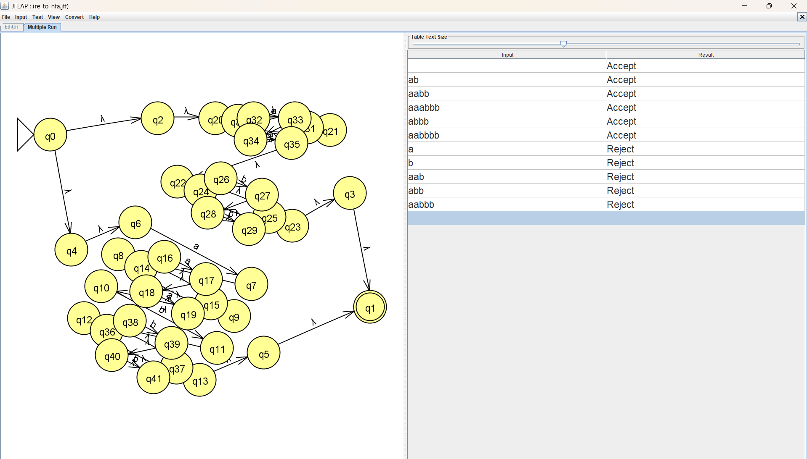

Полученный КА распознаёт язык 
```math
L_1=\{a^n b^m\mid n+m\text{ — чётное число}\}.
```
