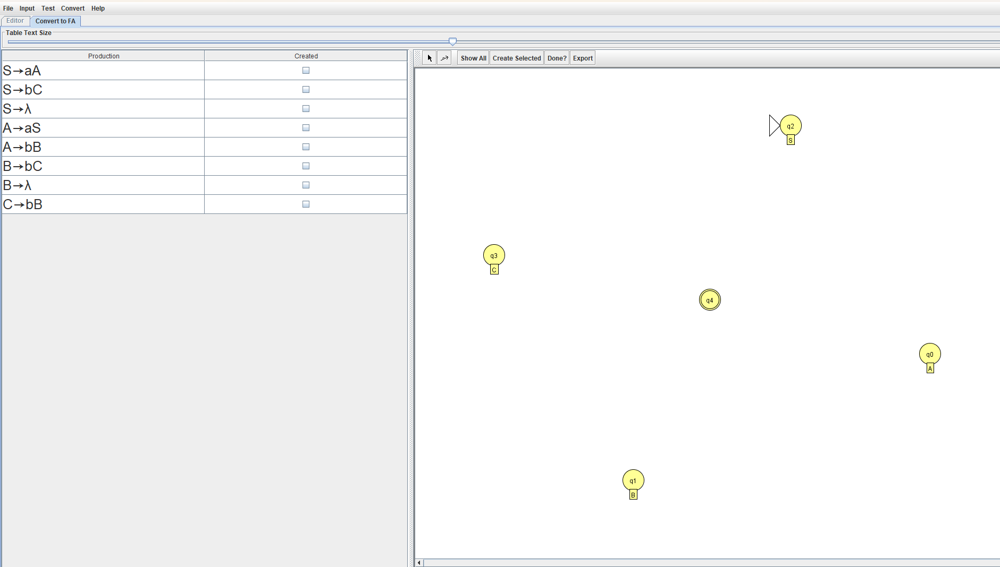
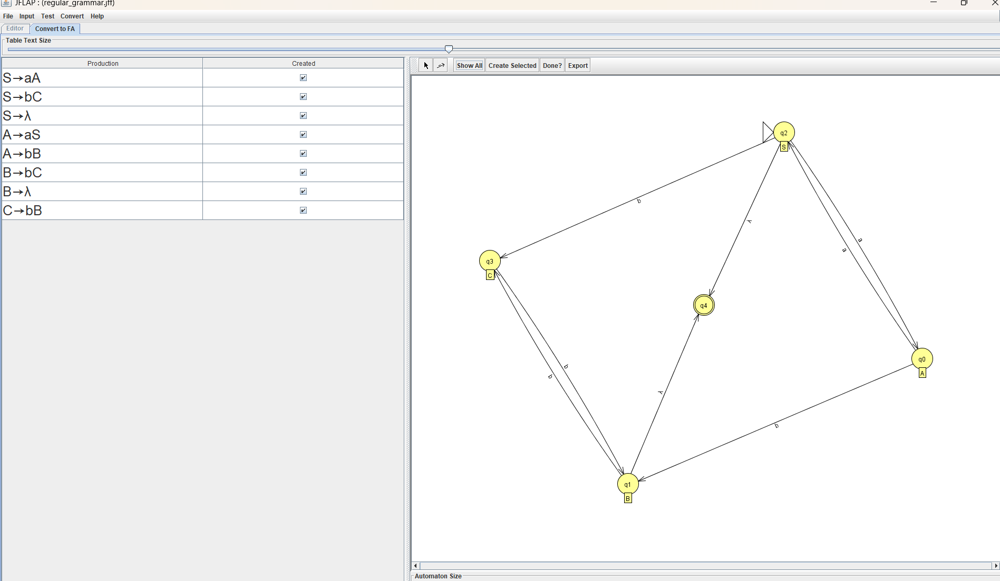
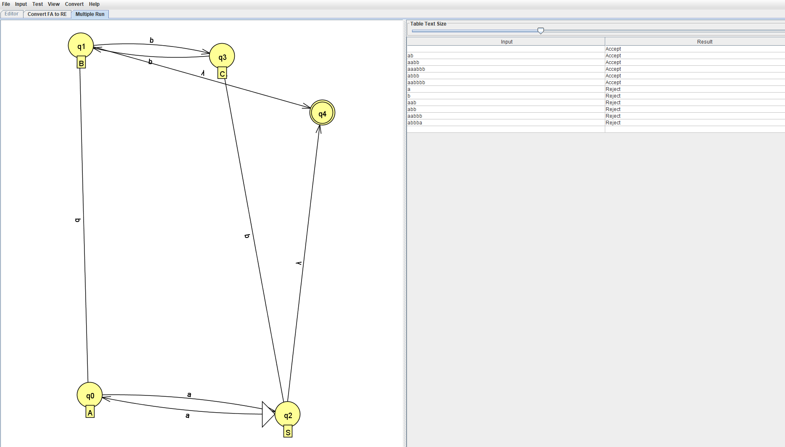
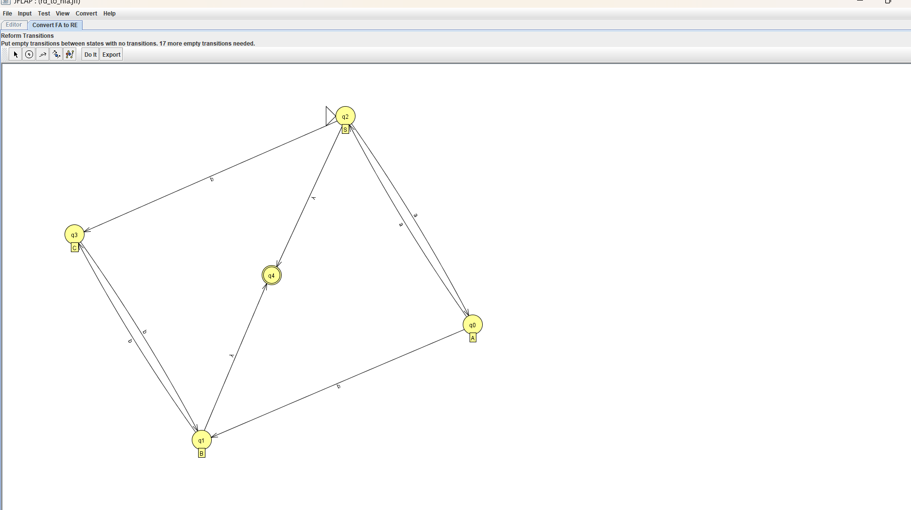
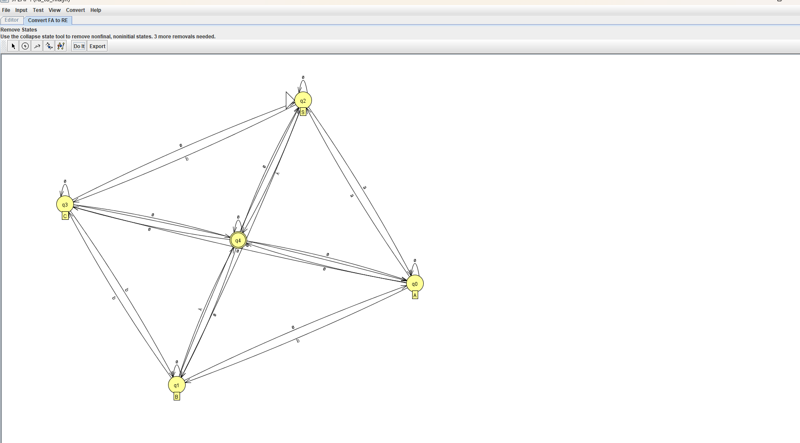
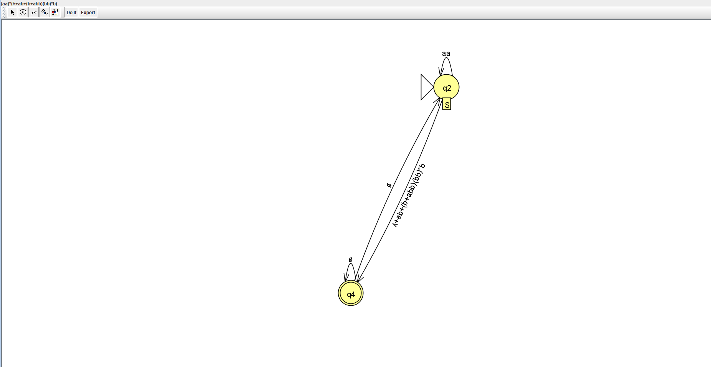

# 6. Шаги выполнения процесса преобразования РГ в КА и РВ

Праволинейная регулярная грамматика для языка

```math
L_1 = \{\, a^n b^m : (n + m) \bmod 2 = 0 \,\}
```

имеет вид:

```text
S -> aA | bB | λ
A -> aS | bC
B -> aC | bS
C -> aB | bA | λ
```

## Преобразование РГ в КА

### 1-й этап преобразования РГ в КА



### 2-й этап преобразования РГ в КА



## Проверка полученного автомата



Полученный автомат распознаёт язык

```math
L_1 = \{\, a^n b^m : (n + m) \bmod 2 = 0 \,\}.
```

## Преобразование КА в РВ

### 1-й этап преобразования КА в РВ



### 2-й этап преобразования КА в РВ



### 3-й этап преобразования КА в РВ



Результатом преобразования является выражение:

```math
(aa)^{*}(\lambda+ab+(b+abb)(bb)^{*}b)
```
